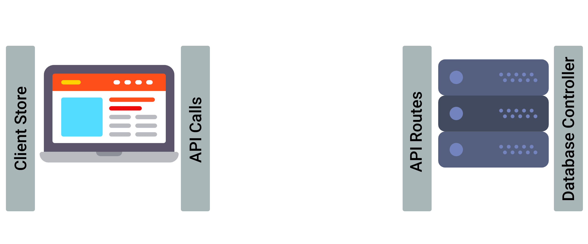
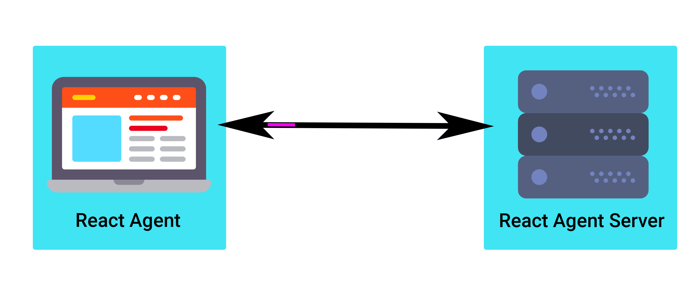

# React Agent

[](https://github.com/yokyak/react-agent/blob/master/LICENSE.txt)
[](https://www.npmjs.com/package/react-agent)
[](https://travis-ci.org/yokyak/react-agent)

React Agent synchronizes client-side and server-side state. It can be included in any React project without conflict with other state management tools or REST APIs.

React Agent is easy to learn.

Here's the basic idea: the client runs 'actions' that are defined on the server-side.

```javascript
run('addUser', { user: 'Billy' })
```

These actions can be as powerful as you want -- i.e. CRUD operations, API calls, and authentication. Moreover, clients can subscribe to server-side actions so that they receive live updates.

React Agent includes offline-support to render optimistic updates and then synchronization on reestablished network connection. It also features time travel debugging.

*Why use React Agent?*

The popular conceptualization of state management stores state in two places: data on the client-side and data on the server-side.

To connect these, front-end and back-end developers usually write a lot of code such as HTTP requests, controllers, and routes. It can get complicated.


In contrast, React Agent serves as a communication channel between the client and the server. It abstracts state transfer to make it super easy to interact between the client and server.


# Getting Started

This guide is focused on client-side usage of React Agent, although it includes necessary details to know about server-side usage. See [React Agent Server](https://github.com/yokyak/react-agent/tree/master/packages/react-agent-server) for more information about server-side set-up.


## Installing
Install the package:
```bash
npm install react-agent --save
```

## How to use
First, import React Agent into your highest level React component.
```javascript
import { Agent } from 'react-agent'
```

Then, wrap your main component with `<Agent>` to start React Agent when your app loads.

```javascript
render(
 <Agent>
   <App />
 </Agent>
 , document.querySelector('#root'))
 ```

Optionally, you can 1) set an initial state for React Agent with `store={initialStore}`. As we’ll see, the state set with React Agent is accessible from any component. And, 2) log in the console what's happening under the hood by including `logger='true'`.

```javascript
const initialStore = {
 first: true,
 second: false,
 third: 'ok'
}

render(
 <Agent store={initialStore} logger='true'>
   <App />
 </Agent>
 , document.querySelector('#root'))
```

Let’s get started on the fun part. Import React Agent into a React component.

```javascript
import { get, set, run, emit, on, unsubscribe } from 'react-agent'
```

There's six methods that make sense to learn. The first two are `set` and `get`, which manipulate state on the client-side, but don't interact with the server. The last four are `run`, `emit`, `on`, and `unsubscribe`, which are used for exchanging client and server-side state. To start, let’s use `set` to write to the React Agent store and `get` to return the values.

### `set` and `get`

The `set` method takes a property/value pair as its parameters by comma seperation or as an object. 

```javascript
set('username', 'Billy')
set({ username: 'Billy' })
```

Multiple property/values pairs can be `set` by including them in consecutive order. 

```javascript
set('age', 28, 'active', true)
set({ age: 28, active: true })
```

The `get` method takes a property and returns the associated value.

```javascript
get(‘username’) // returns ‘Billy’
```

It is also possible to manipulate client-side state in a more complex way using `set` and `get` in conjunction. For example, let's say we want to add a new value to an array in React Agent's store. The array is stored as the value of the property `allUsers.`

```javascript
allUsers = get('allUsers')
set('allUsers', [...allUsers, {user: Billy}])
```
First, we use `get` to assign the current value of `allUsers` to a variable. Then, we take advantage of the ES6 spread operator `...` to easily add `{user: Billy}` to `allUsers`.

Since React Agent’s methods can be imported into any component, React Agent's store is now accessible from any component without ‘passing-down’ props. Under the hood, React Agent uses React’s virtual DOM for efficient rendering.

_Note: while React Agent can be used as a store for state, it can also be used without conflict alongside other state management tools such as Redux or React component state._

### `run`

Now, let's examine the four methods that communicate with the server. Since these methods interact with the server, but do not affect React Agent's store, they are often used in conjunction with `get` and `set` to update client state.

`run` can perform any action on the server-side. For example, it might execute a CRUD operation on a SQL database, or it might execute an API call.

`run` takes a key as its first argument, which corresponds to a matching key on the server-side. When a client calls `run` on a key, the server executes the action labeled by the matching key.

As its optional second argument, `run` takes an object to pass to the server's action.

```javascript
run('addUser', { user: Billy })
```

Here, we `run` the action `addUser`, which executes the action `addUser` on the server-side. That's all we need to do to add a user!

After the action is completed on the server, the promise returned by `run` either resolves or rejects. Then, the client can handle returned data, or catch an error.

```javascript
run('getAllUsers')
  .then(data => {
    set('allUsers', data.users)
  })
  .catch(err => {
    console.log(err)
  })
```


### `emit`, `on`, and `unsubscribe`

In addition to `run`, three other methods interact with the server: `emit`, `on`, and `unsubscribe`.

`emit` sends a state update to all clients who have subscribed to a key. Optionally, it takes an object as a second argument to pass to the server.

```javascript
emit('updateMessages', { cookieID: 937985713 })
```

`on` subscribes a client to a key. That is, if `emit` is called with the corresponding key, the server pushes state updates to all subscribed clients.

```javascript
on('updateMessages', data => {
  set('allMessages', data.messages)
})
```

`unsubscribe` removes a client's subscription to a key so that they no longer receive state updates.

```javascript
unsubscribe('updateMessages')
```

Now, let's bring it together in one big example.

```javascript
// The server will push any updates of 'getAllStudents' to the client.
on('getAllStudents', data => {
  set('allStudents', data.students)
})

// If a user adds Billy as a student, we optimistically update the client's store.
currentUsers = get('allStudents')
set('allStudents', [...currentStudents, { name: Billy }])

// Run the action 'addStudent' to update the server's database.
// If successful, emit an action to all subscribers of 'getAllStudents.'
// If error, revert the client's state to former value before optimistic update.
run('addStudent', { name: Billy })
  .then(() => {
    emit('getAllStudents')
  })
  .catch( err => {
    set('addStudents', currentUsers)
  })

```

## Additional Methods and Features

### Time Travel Debugging

React Agent uses Redux under the hood for time travel debugging. To enable this feature, pass `devTools={true}` to the `<Agent>` wrapper. Then, use Redux DevTools Chrome extension to *travel through time*.

 ```javascript
render( 
  <Agent devTools={true}>
    <App />
  </Agent>
 , document.querySelector('#root'))
 ```

### `destroy`
`destroy` is used to delete a property and its values from React Agent's store. You can pass in multiple properties to delete.

```javascript
destroy('messages')
destroy('users', 'comments', 'messages')
```

### `getStore`

`getStore` returns an object containing the current state of React Agent's entire store. Alternatively, call `get` with no arguments for the same result. 

```javascript
currentState = getStore()
currentState = get()
```

### `isOfflineCacheEmpty`

`isOfflineCacheEmpty` returns a boolean indicating whether any actions sent to the server have not yet been sent back as a response to the client. This method can be useful to determine whether the client has unsaved changes. For example, say the network connection drops, but a user continues interacting with the site because of optimistic rendering. If `isOfflineCacheEmpty` is then called, it would return false.

```javascript
isOfflineCacheEmpty() // returns true or false
```

In fact, React Agent can alert a user that they have unsaved changes -- this feature is turned-off by default. If a user tries to navigate away from the site, it provides a pop-up warning. It uses `isOfflineCacheEmpty` under the hood. To turn on this feature, pass `offlinePopUp={true}` to the `<Agent>` wrapper.

```javascript
render(
 <Agent offlinePopUp={true}>
   <App />
 </Agent>
 , document.querySelector('#root'))
 ```

 ### `run`

 `run` also accepts multiple keys as arguments in the form of an array. As its optional second argument, it takes an object which is passed to every action included in the array. In this configuration, `run` returns a promise, which resolves to an object containing the key of each action and its respective response from the server.

```javascript
run(['addUser', 'addMessage'], { user: 'Billy', message: 'trapped in a simulation.' })
// returns { addUser: { id: 2956739 }, addMessage: { time: 2018-01-19T01:10:47 }}
```

## Contributors

### Authors

* **Tom Rosenblatt** - [https://github.com/tskittles](https://github.com/tskittles)

* **Eric Choi** - [https://github.com/eric2turbo](https://github.com/eric2turbo)

* **Henry Au** - [https://github.com/hhau01](https://github.com/hhau01)

* **Andrew Harris** - [https://github.com/didrio](https://github.com/didrio)

## License

This project is licensed under the MIT License - see the [LICENSE.txt](./../../LICENSE.txt) file for details.
